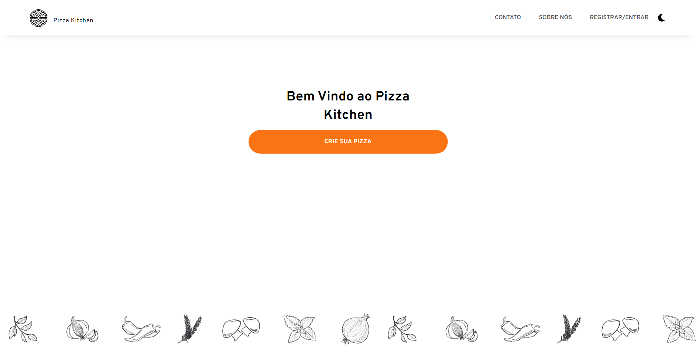

<h1 align="center">Pizza kitchen</h1>

  

## 💣 Projeto

Projeto para portifólio, site responsivo usando tailwind, tentando aprimorar uso do Context e react-router-dom.

## 💻 Tecnologias

Esse projeto foi desenvolvido com as seguintes tecnologias:

- [React](https://reactjs.org)
- [JavaScript](https://developer.mozilla.org/pt-BR/docs/Web/JavaScript)
- [Vite](https://vitejs.dev/)
- [Tailwindcss](https://tailwindcss.com)
- [Firebase](https://firebase.google.com)

## 🚀 Como executar

- Clone o repositório
- Instale as dependências com `npm install`
- Instale o Tailwind com `npm install -D tailwindcss`
- Instale o Tailwind com `npx tailwindcss init`
- Inicie a aplicação com `npm run dev`

A aplicação pode ser acessada em [`localhost:5173`](http://localhost:5173).

Desenvolvido por iSz.
